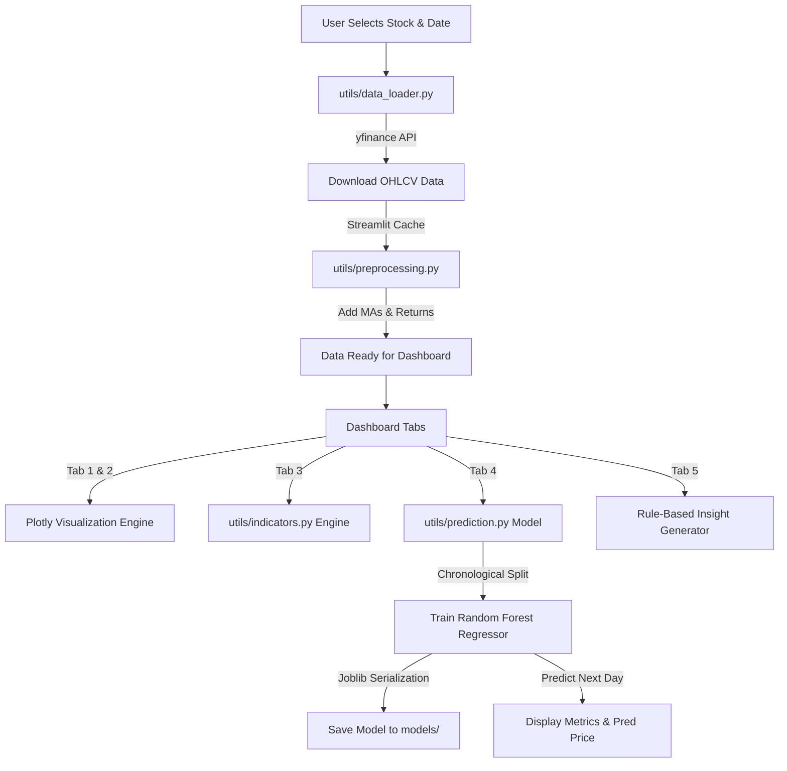
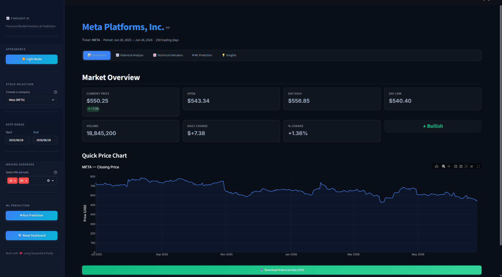
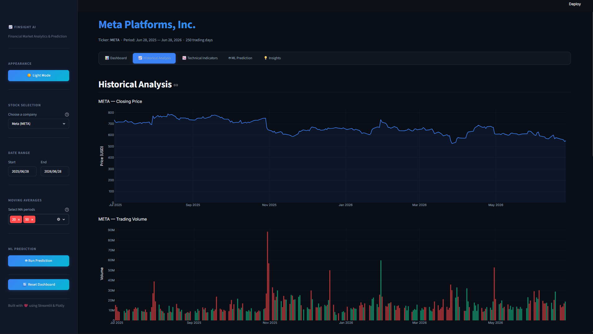
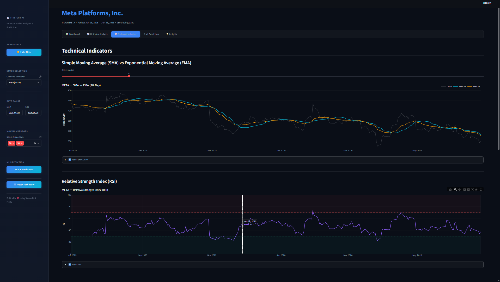
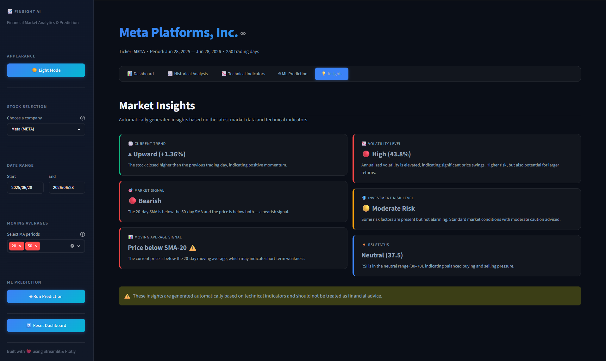

# 📈 FinSight AI — Financial Market Analytics & Stock Prediction Dashboard

<div align="center">


**An interactive financial analytics dashboard that combines real-time stock data, technical analysis, and machine learning predictions — built with Python & Streamlit.**

</div>

---

## 🎯 Project Overview

**FinSight AI** is a production-ready, interactive dashboard designed for analyzing stock market data. It empowers users to:

- 📊 **Explore** historical stock data with interactive charts
- 📈 **Analyze** trends using professional technical indicators (SMA, EMA, RSI, Volatility)
- 🤖 **Predict** the next trading day's closing price using a Random Forest ML model
- 💡 **Gain** automated market insights (trend, risk, signals)
- 📥 **Export** analyzed data and prediction results as CSV

The dashboard features a sleek, dark-themed fintech UI with glassmorphism effects, responsive design, and professional-grade visualizations.

---

## ⚙️ How It Works & Core Architecture

FinSight AI is built using a modular, pipeline-based architecture to guarantee clean separation of concerns, quick response times (using caching), and model safety (preventing time-series leakage). 

Here is the operational workflow of the application:



### 1. Data Ingestion & Caching (`utils/data_loader.py`)
- **Action:** Downloads historical market data (Open, High, Low, Close, Volume) using the `yfinance` library.
- **Optimization:** Utilizes Streamlit's `@st.cache_data` decorator with a Time-To-Live (TTL) of 5 minutes. This ensures that changing tabs or parameters doesn't trigger duplicate network calls, providing a lightning-fast experience.
- **Handling:** Automatically suffixes `.NS` for Indian equities (like Reliance, TCS, Infosys) so users don't need to know exchange codes.

### 2. Feature Engineering & Preprocessing (`utils/preprocessing.py`)
- For standard analysis: Computes Simple Moving Averages (SMA) and Daily Returns.
- For Machine Learning: Builds 17 distinct features from the basic OHLCV data:
  - **Lag Features:** 5 days of previous close prices to capture recent momentum.
  - **Rolling Statistics:** Rolling means and standard deviations over 5, 10, and 20-day windows.
  - **Cyclical Encoding:** Maps days of the week and months to sine/cosine coordinates so the model understands calendar patterns without numerical distortion.

### 3. Financial Calculation Engine (`utils/indicators.py`)
- **SMA:** Simple Moving Average.
- **EMA:** Exponential Moving Average (gives higher weight to recent prices).
- **RSI (Relative Strength Index):** Uses Wilder's smoothing technique to compute gains/losses, classifying assets as overbought (>70) or oversold (<30).
- **Volatility:** Annually scaled standard deviation of percentage daily returns.

### 4. Machine Learning Prediction Pipeline (`utils/prediction.py`)
- **Model:** A Scikit-learn `RandomForestRegressor` with 200 estimators.
- **Chronological Split:** Splits the data into 80% training and 20% testing *without shuffling* to prevent look-ahead bias (data leakage), which is standard practice in time-series forecasting.
- **Evaluation:** Calculates Mean Absolute Error (MAE), Root Mean Squared Error (RMSE), and the R² (Coefficient of Determination) Score.
- **Persistence:** Serializes the trained model into the `models/` directory using `joblib`.

### 5. Automation & Insights Engine (`app.py`)
- Analyzes indicators dynamically:
  - Detects crossovers (e.g. if the short-term SMA is above the long-term SMA).
  - Assesses risk levels (based on a combination of high volatility, daily returns direction, and extreme RSI states).
  - Determines market signals (Bullish, Bearish, or Neutral) and visualizes them on dashboard cards.

---

## ✨ Features

### 📊 Dashboard Overview
- Real-time KPI cards: Current Price, Open, High, Low, Volume, Daily Change, % Change
- Market sentiment badge (Bullish / Bearish)

### 📈 Historical Analysis
- Interactive Closing Price chart with gradient fill
- Trading Volume bar chart (green/red based on daily direction)
- OHLC Candlestick chart
- Customizable Moving Averages (20/50/100-day)
- Daily Returns distribution histogram

### 📉 Technical Indicators
- **SMA vs EMA** comparison with adjustable periods
- **RSI** with overbought/oversold zones highlighted
- **Daily Returns** statistics and distribution
- **Rolling Volatility** (annualized) with adjustable window
- Educational explanations for each indicator

### 🤖 Machine Learning Prediction
- **Random Forest Regressor** with 200 estimators
- Engineered features: lag values, rolling statistics, calendar encoding
- Chronological train/test split (no data leakage)
- Evaluation metrics: MAE, RMSE, R² Score
- Feature importance visualization
- Model persistence via Joblib

### 💡 Smart Insights
- Current Trend analysis
- Bullish/Bearish market signal
- Moving Average signal
- Volatility assessment
- Investment Risk Level
- RSI status (Overbought/Oversold/Neutral)

### 📥 Export
- Download historical data as CSV
- Download prediction results as CSV

---

## 🛠️ Technology Stack

| Technology    | Purpose                          |
|---------------|----------------------------------|
| Python 3.10+  | Core programming language        |
| Streamlit     | Web dashboard framework          |
| Pandas        | Data manipulation & analysis     |
| NumPy         | Numerical computing              |
| Plotly        | Interactive data visualizations  |
| scikit-learn  | Machine learning (Random Forest) |
| Joblib        | Model serialization              |
| yfinance      | Yahoo Finance API data source    |

---

## 📁 Project Structure

```
FinSight-AI/
│
├── app.py                  # Main Streamlit application
├── requirements.txt        # Python dependencies
├── README.md               # Project documentation
├── LICENSE                  # MIT License
│
├── assets/
│   ├── style.css           # Custom dark theme CSS
│   └── logo.png            # Generated fintech logo icon
│
├── data/                   # Cached / downloaded data
├── models/                 # Saved ML models (Joblib)
├── exports/                # Exported CSV files
├── images/                 # Screenshots & assets
├── notebooks/              # Jupyter notebooks (exploration)
│
└── utils/
    ├── __init__.py          # Package initializer
    ├── data_loader.py       # Stock data retrieval & caching
    ├── preprocessing.py     # Feature engineering & data prep
    ├── indicators.py        # Technical indicator calculations
    ├── prediction.py        # ML model training & prediction
    └── visualization.py     # Plotly chart functions
```

---

## 🚀 Installation Guide

### Prerequisites
- Python 3.10 or higher
- pip package manager
- Internet connection (for fetching stock data)

### Steps

1. **Clone the repository**
   ```bash
   git clone https://github.com/yourusername/FinSight-AI.git
   cd FinSight-AI
   ```

2. **Create a virtual environment**
   ```bash
   python -m venv venv
   
   # Windows
   venv\Scripts\activate
   
   # macOS/Linux
   source venv/bin/activate
   ```

3. **Install dependencies**
   ```bash
   pip install -r requirements.txt
   ```

4. **Run the dashboard**
   ```bash
   streamlit run app.py
   ```

5. **Open your browser** at `http://localhost:8501`

---

## 📸 Screenshots


| Dashboard Overview | Historical Analysis |
|:-:|:-:|
|  |  |

| Technical Indicators |
|:-:|
|  |

| Market Insights |
|:-:|
|  |

---

## 🏢 Supported Stocks

| Company    | Ticker      | Exchange |
|------------|-------------|----------|
| Apple      | AAPL        | NASDAQ   |
| Microsoft  | MSFT        | NASDAQ   |
| Tesla      | TSLA        | NASDAQ   |
| Amazon     | AMZN        | NASDAQ   |
| Google     | GOOGL       | NASDAQ   |
| NVIDIA     | NVDA        | NASDAQ   |
| Meta       | META        | NASDAQ   |
| Reliance   | RELIANCE.NS | NSE      |
| TCS        | TCS.NS      | NSE      |
| Infosys    | INFY.NS     | NSE      |

---

## 🔮 Future Improvements

- [ ] Add LSTM / deep learning model for time-series forecasting
- [ ] Real-time streaming price data via WebSocket
- [ ] Portfolio tracking with multi-stock comparison
- [ ] Sentiment analysis from financial news headlines
- [ ] Options chain analysis and Greeks calculation
- [ ] User authentication and personalized watchlists
- [ ] Backtesting framework for trading strategies
- [ ] PDF report generation with charts

---

## 📄 License

This project is licensed under the **MIT License** — see the [LICENSE](LICENSE) file for details.

---


## Internship Project

This project was developed as part of my **Artificial Intelligence Internship at Codec Technologies**.

The objective was to apply AI, machine learning, and data visualization techniques to build a financial market analytics dashboard capable of providing insights and next-day stock price predictions.


---

## 👤 Author

**Rajwant-Raj**

- GitHub: [@rajwant-raj](https://github.com/rajwant-raj)
- LinkedIn: [rajwant-raj](https://linkedin.com/in/rajwant-raj)


---

<div align="center">
<br>
<i>Built with ❤️ using Python, Streamlit, and Plotly</i>
<br><br>
⭐ If you found this project helpful, please give it a star!
</div>
